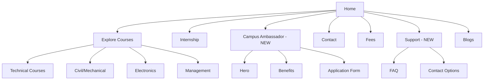

# PerseVex Website Redesign Specification

## Project Overview

Redesign the PerseVex website with:

- **Content Source**: <https://persevex.com>
- **Design Inspiration**: <https://jyesta.com> and <https://www.aptisure.com/>
- **LinkedIn Reviews**: <https://smarted.in/>

---

## Current Website Analysis

### Existing Pages

| Page | Status | Action |
|------|--------|--------|
| Home | Exists | Update content & animations |
| Explore Courses | Exists | Update course listings |
| Internship | Exists | Keep as-is |
| Campus Ambassador | **Missing** | Create new |
| Contact | Exists | Update from persexvex.com |
| Fees | Exists | Keep |
| Blogs | Exists | Keep |
| Privacy Policy | Exists | Keep |
| Terms & Conditions | Exists | Keep |
| Data Deletion | Exists | Keep |
| Return Policy | Exists | Keep |
| Support | **Missing** | Create new |

### Existing Components

- Hero, CoursesSection, PartnersSection, Testimonials, FAQ
- AboutUsSection, FooterSection, Appbar
- Various animation components (StarField, DustParticles, etc.)

---

## Requirements by Section

### 1. Header Navigation

- Logo & Brand
- Our Edge (Why Choose Us)
- Partners (Companies)
- Testimonials (LinkedIn Reviews)
- Courses Dropdown
- Contact

### 2. Domains/Courses to Display

#### Technical Domain

- Full Stack Web Development
- Cloud Computing
- Machine Learning
- Artificial Intelligence
- Data Science
- CyberSecurity

#### Civil Domain

- AutoCAD

#### Mechanical Domain

- AutoCAD
- Drone Mechanics
- HEVs (Hybrid Electric Vehicles)

#### Business Domain

- Business Law (Coming Soon)
- Generative AI & Prompt Engineering (Coming Soon)

#### Electronics & Electrical Domain

- IoT (Internet of Things)
- Embedded Systems
- VLSI

#### Management & Commerce Domain

- HR
- Digital Marketing
- Finance
- Logistics & Supply Chain
- Business Analytics
- Stock Market & Crypto Currency

### 3. Campus Ambassador Page

**Reference**: <https://www.jyesta.com/campus>

- Hero section with engaging visuals
- Benefits listing
- Application form
- Testimonials from ambassadors

### 4. Support Page

**Reference**: <https://www.jyesta.com/support>

- FAQ section
- Contact options
- Ticket system UI

### 5. Why Choose Us Section

**Source**: <https://www.persevex.com/>

- Key value propositions
- Differentiation points

### 6. Companies/Partners Section

**Source**: <https://www.persevex.com/>

- Partner logos
- Placement companies

### 7. LinkedIn Reviews Section

**Reference**: <https://smarted.in/>

- LinkedIn testimonial cards
- Profile pictures
- Names and titles

### 8. Recognized By Section

**Source**: <https://www.persevex.com/>

- Certification logos
- Recognition badges

### 9. About Us Section

**Source**: <https://www.persevex.com/>

- Our Story
- Our Mission
- Team information

### 10. Frequently Asked Questions

**Source**: <https://www.persevex.com/>

- Course-related FAQs
- General FAQs

### 11. Contact Us Page

**Source**: <https://www.persevex.com/>

- Contact form
- Contact information
- Location details

### 12. Footer

**Reference**: <https://www.jyesta.com/>

- Quick links
- Social media
- Legal links
- Newsletter signup

---

## Design & Animation Requirements

### Animation Inspiration

- **jyesta.com**: Smooth scroll animations, parallax effects, card hover effects
- **aptisure.com**: Modern transitions, subtle micro-interactions, engaging hero animations

### Recommended Animations

1. **Hero Section**: Animated background with particle/star effects, text reveal animations
2. **Course Cards**: Hover scale effects, smooth transitions
3. **Scroll Animations**: Fade-in on scroll, staggered reveals
4. **Parallax Effects**: Background movement on scroll
5. **Button Interactions**: Smooth hover states, ripple effects
6. **Loading States**: Skeleton loaders, smooth transitions

---

## Implementation Plan

### Phase 1: Core Structure (High Priority)

1. [ ] Create Campus Ambassador page
2. [ ] Create Support page
3. [ ] Update course data in courseConstant.tsx

### Phase 2: Content Updates (Medium Priority)

4. [ ] Update Why Choose Us section content
2. [ ] Update Partners section
3. [ ] Update Testimonials to LinkedIn reviews format
4. [ ] Update Recognized By section
5. [ ] Update About Us section

### Phase 3: Design & Animations (Medium Priority)

9. [ ] Improve hero animations
2. [ ] Add scroll-triggered animations
3. [ ] Enhance card hover effects
4. [ ] Update footer design

### Phase 4: Polish (Lower Priority)

13. [ ] Mobile responsiveness improvements
2. [ ] Performance optimizations
3. [ ] Accessibility improvements

---

## File Changes Required

### New Files

- `app/(main)/campus-ambassador/page.tsx`
- `app/(main)/support/page.tsx`

### Files to Update

- `app/constants/courseConstant.tsx`
- `app/components/OurEdgeSection.tsx`
- `app/components/PartnersSection.tsx`
- `app/components/Testimonials.tsx`
- `app/components/RecognizedBySection.tsx`
- `app/components/AboutUsSection.tsx` or `AboutUsExtendedComp.tsx`
- `app/components/FaqSection.tsx` or `FrequentlyAskedQuestions.tsx`
- `app/components/ContactUs.tsx`
- `app/components/FooterSection.tsx`
- `app/(main)/page.tsx` (Landing page)
- `app/components/Hero.tsx` (animations)

---

## Mermaid: Website Structure After Changes

